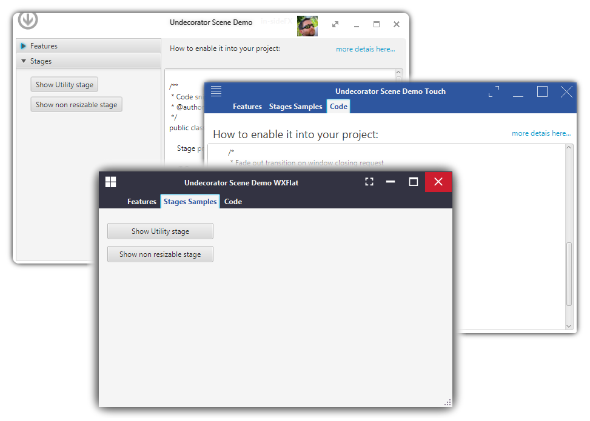

A fork of UndecoratorBis
========================

In 2014 Arnaud Nouard created a newer version of his JavaFX window decoration API called <a href="https://github.com/in-sideFX/Undecorator">Undecorator</a> with a focus on transparency and non-rectangular window support.

As I really like the chosen approach and the API is released with a BSD-2-Clause license, I will try to continue development. 

### The first steps are:

 * update the Gradle build to work with Gradle 5.2.1 or newer :+1:
 * enable Gradle Wrapper :+1:
 * Publish version 0.1.0 on [https://search.maven.org](https://search.maven.org/search?q=g:net.raumzeitfalle.fx%20AND%20a:undecorator) :+1:
 * Introduce concept of themes. :+1:
 * Add example using FontawesomeFX :+1:
 * Add example using SVG paths, make FontawesomeFX optional or a dependency of the concrete Theme used 
 * Add a new theme called WXflat when completed (utility stage is not finalized yet)
 * Make fullscreen optional and configurable (permit and deny fullscreen)
 * Make fullscreen button animation optional and configurable
 * Make window resize handle in lower right optional
 * Replace theme properties with CSS and consider removing the properties code
 * Add option to place client fxml into a dedicated area (pane) in decoration (e.g. right now the decoration overlaps the client content but in some cases this is not wanted)
 * Make stage transparency working with WXFlat
 * Expose titleProperty to re-enable use of bindings  
 * Add basic tests with JUnit 5 and TestFX
 * Make the project work with Java 11 and JavaFX 11
 * Add Ubuntu-like and OSX-like skins
 * Add description on how Themes work, describe all style classes, all fx:ids and their purpose, how things work together.

Well, he would like to see more screenshots of apps built using UndecoratorBis, this will happen. I have already implemented 2 new themes and will share screens of them soon. The demo apps will be updated as well.

The reason why I'd like to publish this one on https://search.maven.org is, that the environment where UndecoratorBis will be used, does not support other repositories than search.maven.org.

## License

Copyright (c) 2014-2016, in-sideFX
All rights reserved.

BSD License All rights reserved.

Redistribution and use in source and binary forms, with or without 
modification, are permitted provided that the following conditions are met:

Redistributions of source code must retain the above copyright notice, this list of conditions and the following disclaimer.
Redistributions in binary form must reproduce the above copyright notice, this list of conditions and the following disclaimer in the documentation and/or other materials provided with the distribution.
Neither the name of the In-SideFX nor the names of its contributors may be used to endorse or promote products derived from this software without specific prior written permission.

THIS SOFTWARE IS PROVIDED BY THE COPYRIGHT HOLDERS AND CONTRIBUTORS "AS IS" AND ANY EXPRESS OR IMPLIED WARRANTIES, INCLUDING, BUT NOT LIMITED TO, THE IMPLIED WARRANTIES OF MERCHANTABILITY AND FITNESS FOR A PARTICULAR PURPOSE ARE DISCLAIMED. IN NO EVENT SHALL BE LIABLE FOR ANY DIRECT, INDIRECT, INCIDENTAL, SPECIAL, EXEMPLARY, OR CONSEQUENTIAL DAMAGES (INCLUDING, BUT NOT LIMITED TO, PROCUREMENT OF SUBSTITUTE GOODS OR SERVICES; LOSS OF USE, DATA, OR PROFITS; OR BUSINESS INTERRUPTION) HOWEVER CAUSED AND ON ANY THEORY OF LIABILITY, WHETHER IN CONTRACT, STRICT LIABILITY, OR TORT (INCLUDING NEGLIGENCE OR OTHERWISE) ARISING IN ANY WAY OUT OF THE USE OF THIS SOFTWARE, EVEN IF ADVISED OF THE POSSIBILITY OF SUCH DAMAGE.

## Release Notes

### 0.1.0
 * Code forked from https://github.com/in-sideFX/UndecoratorBis
 * Gradle build script updated so that it works with Gradle 5.2.1
 * Gradle Wrapper added
 * Version 0.1.0 of UndecoratorBis now released to [The Central Repository](https://search.maven.org/search?q=g:net.raumzeitfalle.fx)
 * This version is API compatible with [UndecoratorBis](https://github.com/in-sideFX/UndecoratorBis) as available at [Bintray](https://bintray.com/in-sidefx/maven/undecorator).
